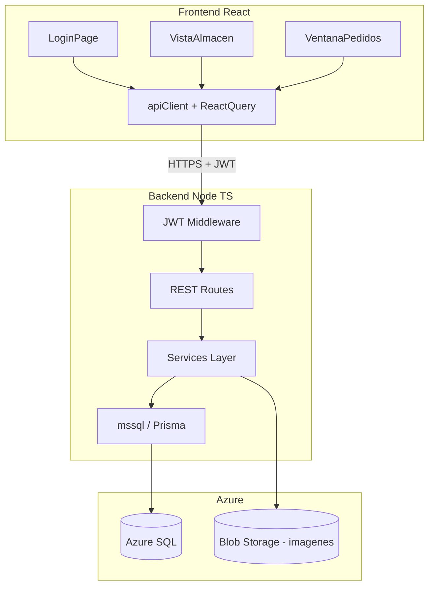
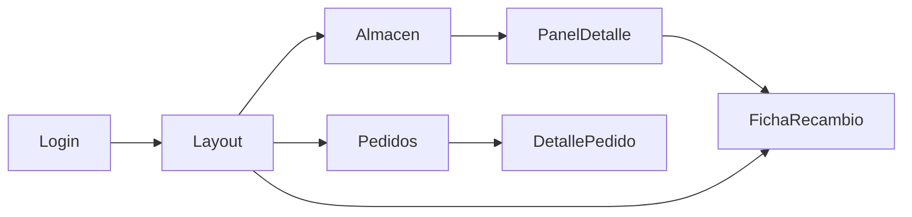

# Plan: SEE_Ferreteria — Stack completo desde cero

## Contexto actual

- **Requisitos funcionales**: definidos en [Prompt cubetas.txt](c:\Users\thedu\OneDrive\Escritorio\Prompt cubetas.txt) — login, almacén con ~20 paneles (A1–A20) de 5×20 cubetas, ficha técnica de recambios, 3 tipos de pedido, ventana de pedidos con filtros, búsqueda por nombre/referencia/QR, rol admin para CRUD de recambios, paleta azul oscuro + blanco.
- **Base de datos**: 6 tablas en Azure SQL según [Diseño DB Ferreteria.odt](c:\Users\thedu\OneDrive\Escritorio\Diseño DB Ferreteria.odt):
  - `Users` (auth + roles `admin`/`user`, password hasheada)
  - `Familias` / `Subcategorias` (catálogo)
  - `Recambios` (tabla central + ubicación `panel/col/row`, `UQ_Recambio_Ubicacion`)
  - `Pedidos` (tipos, estados, `prioritario`)
  - `PedidosEstadoHistorial` (auditoría de cambios de estado)
- **Código existente**: [src/App.tsx](src/App.tsx) es un prototipo monolítico con datos mock; **no se reutilizará** (faltan constantes, no compila limpio, sin backend). Solo sirve como referencia visual de UX.

## Arquitectura propuesta



### Stack técnico

| Capa | Tecnología |
|------|------------|
| Frontend | React 19 + TypeScript + Vite, React Router, TanStack Query, CSS Modules o Tailwind |
| Backend | Node.js + Express + TypeScript |
| BD | Azure SQL (driver `mssql` o Prisma con provider `sqlserver`) |
| Auth | bcrypt/Argon2 + JWT en cookie `httpOnly` + refresh token opcional |
| QR | `@zxing/browser` o `html5-qrcode` para escaneo con cámara |
| Imágenes | Azure Blob Storage (campo `imagen` en `Recambios`) |

### Estructura de carpetas (nueva)

```
SEE_Ferreteria/
├── backend/
│   ├── src/
│   │   ├── config/          # env, db pool
│   │   ├── middleware/      # auth, error handler, validate
│   │   ├── routes/          # auth, recambios, pedidos, catalogos
│   │   ├── services/        # logica de negocio
│   │   ├── repositories/    # queries SQL
│   │   └── types/
│   ├── .env.example
│   └── package.json
├── database/
│   ├── 001_schema.sql       # DDL del ODT
│   ├── 002_seed.sql         # familias, subcategorias, admin, paneles demo
│   └── README.md            # instrucciones Azure SQL
├── src/                     # frontend limpio (reemplazar App.tsx actual)
│   ├── api/
│   ├── components/
│   ├── pages/
│   ├── hooks/
│   ├── types/
│   └── styles/
└── package.json             # scripts raíz: dev frontend + backend en paralelo
```

## Fase 1 — Infraestructura y base de datos

1. **Reorganizar el repo**: limpiar el prototipo actual; crear `backend/` y `database/`.
2. **Script SQL en Azure**: ejecutar el DDL del ODT tal cual en Azure SQL, añadiendo:
   - Trigger o lógica en backend para `Pedidos.prioritario = 1` cuando `tipo = 'Solicitud Express'`.
   - Trigger en `Pedidos` para insertar en `PedidosEstadoHistorial` al cambiar `estado`.
3. **Seed inicial**:
   - Usuario admin (`admin` / contraseña configurable vía env).
   - Familias y subcategorías base (Tornillería, Electricidad, etc.).
   - Recambios de prueba distribuidos en paneles A1–A3 (no hace falta poblar las 2000 cubetas al inicio).
4. **Variables de entorno** (`backend/.env`):
   - `AZURE_SQL_SERVER`, `AZURE_SQL_DATABASE`, `AZURE_SQL_USER`, `AZURE_SQL_PASSWORD`
   - `JWT_SECRET`, `CORS_ORIGIN`
   - `AZURE_STORAGE_CONNECTION_STRING` (fase posterior de imágenes)

## Fase 2 — Backend API

### Endpoints principales

| Método | Ruta | Rol | Descripción |
|--------|------|-----|-------------|
| POST | `/api/auth/login` | público | Login → JWT |
| POST | `/api/auth/logout` | auth | Invalidar sesión |
| GET | `/api/auth/me` | auth | Usuario actual |
| GET | `/api/recambios` | auth | Listado con filtros (panel, búsqueda, ocultos) |
| GET | `/api/recambios/:id` | auth | Ficha completa + historial pedidos |
| GET | `/api/recambios/ref/:ref` | auth | Búsqueda por referencia CMH/cliente (QR) |
| POST | `/api/recambios` | admin | Crear recambio (validar cubeta libre) |
| PUT | `/api/recambios/:id` | admin | Editar |
| PATCH | `/api/recambios/:id/oculto` | admin | Ocultar/mostrar |
| DELETE | `/api/recambios/:id` | admin | Borrar (validar sin pedidos activos) |
| GET | `/api/paneles` | auth | Resumen por panel (conteo recambios) |
| GET | `/api/paneles/:id/cubetas` | auth | Grid 5×20 de un panel |
| POST | `/api/pedidos` | auth | Crear pedido (3 tipos) |
| GET | `/api/pedidos` | auth | Lista con filtros (tipo, fecha, antigüedad, finalizados) |
| GET | `/api/pedidos/:id` | auth | Detalle + historial estados |
| PATCH | `/api/pedidos/:id/estado` | auth/admin | Avanzar estado + registrar historial |
| GET | `/api/catalogos/familias` | auth | Familias + subcategorías |

### Reglas de negocio críticas (backend)

- **Reposición**: `cantidad = recambio.nReposicion`, `plazoDeseado = recambio.plazoEntrega`.
- **Solicitud**: `cantidad` y `plazoDeseado` obligatorios.
- **Solicitud Express**: `prioritario = true`; cantidad opcional (default `nReposicion`).
- **Pedidos finalizados**: excluidos por defecto en `GET /api/pedidos`; incluidos solo con `?incluirFinalizados=true`.
- **Orden por defecto**: Express primero, luego por `fechaSolicitud DESC`.
- **Solicitante**: tomado del JWT (`Users.name`), no del body.
- **Ubicación única**: respetar `UQ_Recambio_Ubicacion` al crear/editar recambios.

## Fase 3 — Frontend (desde cero)

### Páginas y flujo



1. **LoginPage**: formulario contra `POST /api/auth/login`; guardar sesión vía cookie httpOnly.
2. **Layout / Navbar** (sticky):
   - Búsqueda con autocomplete (nombre, `referenciaCMH`, `referenciaCliente`).
   - Botón QR → modal con cámara + fallback manual.
   - Navegación: Almacén | Pedidos (badge urgentes).
   - Usuario + logout.
   - Botón "+ Nuevo Recambio" solo si `role === 'admin'`.
3. **Vista Almacén**:
   - Scroll horizontal de miniaturas A1–A20.
   - Click panel → vista ampliada 5×20 cubetas.
   - Click cubeta con recambio → modal ficha técnica.
4. **Ficha técnica** (tabs: Info | Historial | Nuevo pedido):
   - Acciones admin: editar, ocultar, eliminar.
   - 3 botones de pedido según requisitos.
5. **Ventana Pedidos**:
   - Búsqueda + filtros (tipo, fecha, antigüedad, toggle finalizados).
   - Lista priorizando Express.
   - Click → detalle con avance de estado.
6. **Diseño**: azul medio-oscuro (`#0d1b2e`, `#1a3a5c`) + acentos `#4db8ff`, tipografía Exo 2 — coherente con la idea visual del prototipo.

### Estado y datos

- TanStack Query para cache de recambios, paneles y pedidos.
- Contexto mínimo de auth (`useAuth`) con datos de `/api/auth/me`.
- Tipos TypeScript alineados 1:1 con el esquema SQL.

## Fase 4 — Integración y pulido

- **CORS + proxy Vite** en desarrollo (`/api` → `localhost:3001`).
- **Validación**: Zod en backend (request bodies) y frontend (formularios).
- **Manejo de errores**: toasts para conflictos de cubeta ocupada, credenciales inválidas, etc.
- **Imágenes**: subida a Azure Blob en creación/edición de recambio (fase 4b; placeholder URL mientras tanto).
- **Seguridad**: rate limit en login, helmet, sanitización SQL parametrizada.

## Fase 5 — Verificación

Checklist manual:

- [ ] Login admin y user; admin ve botón crear recambio, user no.
- [ ] Navegar paneles A1–A20; ampliar panel; abrir cubeta.
- [ ] Buscar por nombre y referencia; QR con referencia CMH.
- [ ] Crear pedidos Reposición / Solicitud / Express con reglas correctas.
- [ ] Lista pedidos: Express arriba, finalizados ocultos por defecto.
- [ ] Avanzar estados y verificar `PedidosEstadoHistorial`.
- [ ] Editar, ocultar y borrar recambio (solo admin).

## Orden de implementación recomendado

1. `database/001_schema.sql` + seed + conexión Azure verificada desde backend.
2. Auth (login, middleware JWT, seed admin).
3. API recambios + paneles (lectura primero).
4. Frontend: login + layout + almacén (solo lectura).
5. API y UI de pedidos.
6. CRUD recambios (admin) + ficha técnica completa.
7. QR, filtros avanzados, historial de estados.
8. Imágenes en Blob Storage.

## Riesgos y mitigaciones

- **Azure SQL firewall**: añadir IP de desarrollo en Azure Portal antes de conectar.
- **2000 cubetas**: cargar solo el panel activo (`GET /api/paneles/:id/cubetas`), no todos los recambios a la vez.
- **QR en desktop**: ofrecer siempre entrada manual además de cámara.
- **Prototipo roto actual**: eliminar/reemplazar [src/App.tsx](src/App.tsx) en la primera tarea de frontend para evitar confusión.

## Entregable de esta fase

Al confirmar el plan, la primera iteración de código incluirá: estructura monorepo, scripts SQL, backend con auth + endpoints de lectura, y frontend con login + vista de almacén conectada a Azure SQL.
